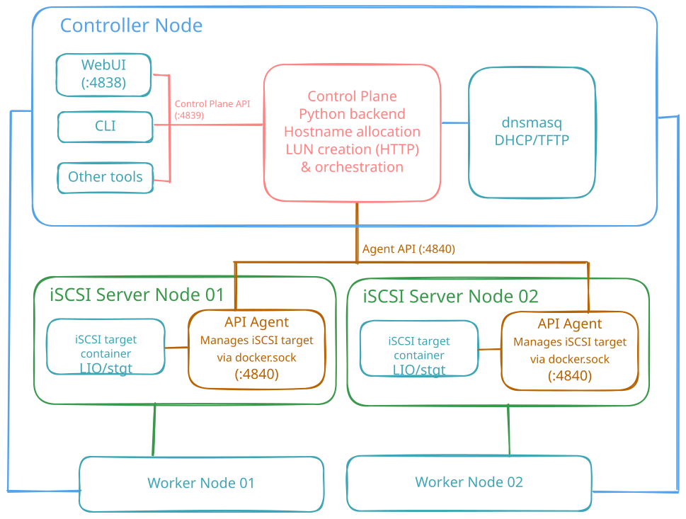

# Architecture

Three roles, cleanly separated along the **control plane / data plane** line:

- **Controller** — The brain. Runs the Control Plane HTTP service (worker lifecycle, agent scheduling, storage ledger, dnsmasq bindings, boot-variable projection) plus DHCP/TFTP/HTTP boot services, all containerized.
- **iSCSI Server** — Block storage. Each node runs an API Agent that executes Control Plane commands against a local stgt/LIO backend; backend differences are encapsulated inside the Agent.
- **Worker** — A stateless compute node with no local disk. PXE-boots, attaches its iSCSI system disk, runs the OS; block I/O travels the iSCSI data plane, never the control plane.
