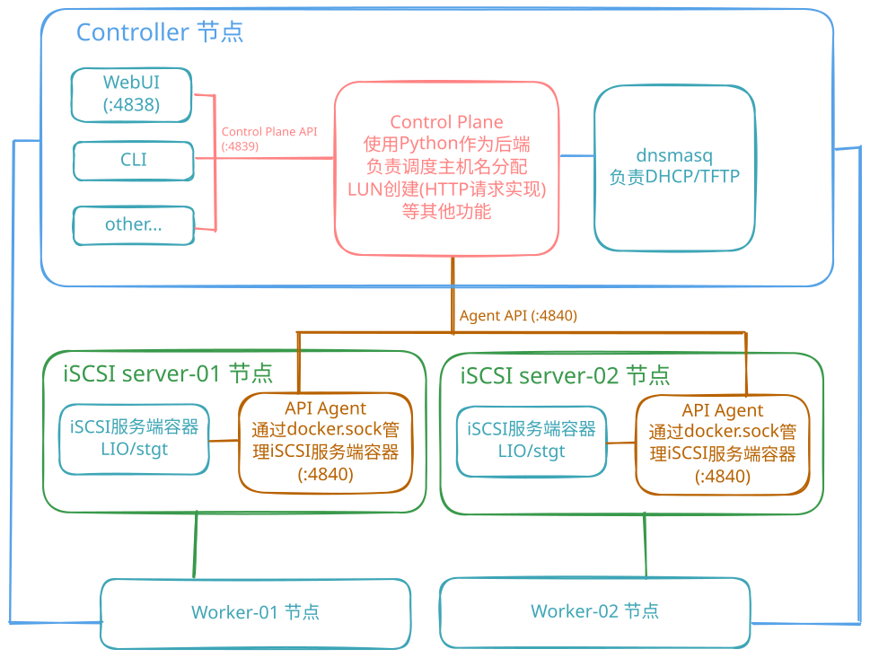

# 架构

## 控制面 / 数据面分离

系统沿一条清晰的线切分:**控制面**经 HTTP 处理身份、调度与配置;**数据面**承载 iSCSI 块读写,永远不经过控制面。Worker 的磁盘流量在设备与 Storager 节点之间直连,控制面故障只会影响开通流程,不会中断进行中的 I/O。

## 三个角色

### Controller(控制器)

集群大脑。一个容器化节点,运行:

- **控制面 HTTP 服务**(:4839)——设备台账与设备池、设备↔Worker 绑定、Worker 生命周期编排、存储调度(LUN 创建 / 挂载)、启动变量投影、审计日志
- **dnsmasq**——PXE 引导所需的 DHCP / TFTP / HTTP 服务
- **Web UI**(:4838)——REST API 的一个客户端,不是独立系统

全部状态以纯文件(YAML / JSONL)持久化,不引入数据库。

### Storager(存储节点)

块存储。每节点运行一个 **API Agent**(:4840),经 docker.sock 驱动本地 iSCSI 服务端容器(LIO/stgt)执行控制面指令。后端差异封装在 Agent 内部:控制面只发 HTTP,Agent 翻译为后端操作,数据面地址经启动变量下发给设备。

### Devices(算力设备)

无状态计算侧。物理设备无本地盘:PXE 引导时上报指纹(MAC / UUID / SMBIOS / CPU / 内存 / 网卡)并自动进入**设备池**;绑定到 Worker(计算身份)并挂载系统盘后,挂载 iSCSI 系统盘运行操作系统。块读写直走 iSCSI 数据面,不经过控制面。

## 三实体模型:设备、Worker 与系统盘

角色层对应三个实体对象:

| 实体 | 身份 | 说明 |
|---|---|---|
| **设备(Device)** | MAC(唯一) | 物理机器,台账条目;绑定的权威侧 |
| **Worker** | `worker_id`(即 hostname) | 计算身份;设备绑定到 Worker 后成为该 Worker 的引导节点 |
| **系统盘(System Disk)** | IQN | 存储卷(母盘克隆或空白盘);每 Worker 可挂多块 |

绑定关系权威在**设备侧**(`bound_worker_id`),Worker 侧只是投影。盘机分离:解绑或换绑时设备回池,系统盘保留在 Worker 上。

- 设备生命周期:`pooled`(池中待绑定)→ `bound` → `revoked`
- `force=true` 换绑是原子的:新绑定落盘 → 旧绑定清除 → 失败时回滚台账快照
- 一台 Worker 可挂载多块系统盘(Windows / Ubuntu / Debian / CentOS / ESXi),默认启动系统可在线切换

## 引导链路

1. 设备通电 → DHCP(dnsmasq)→ TFTP 下载 iPXE → iPXE 启动
2. iPXE 向 `/devices/report` 上报指纹;未知 MAC 自动入池(自动注册关闭时除外)
3. iPXE 请求 `/boot-vars`;请求**经绑定校验**——带 `mac` 的请求必须来自命中 Worker 的绑定设备,否则返回空脚本(绑定即认证)
4. 已绑定设备:启动变量指向其系统盘 → iSCSI 登录(数据面)→ 运行操作系统
5. 池中未绑定设备:reboot 循环等待绑定

## 状态存储:文件即真相

无数据库。控制面每个状态文件都是纯文本,可 diff、可手工修复:

- `state/devices.yml`——设备台账(设备池 / 绑定)
- `state/workers.yml`——Worker 台账
- `state/settings.json`——运行时设置(如自动注册开关)
- `state/operations.jsonl`——全部管理操作的审计流水
- `config/agents.yml`——已登记的 Storager Agent

全部能力经 REST 开放;Web UI 只是一个客户端,CLI 是另一个。

## 安全边界

- **API Token** 保护全部管理端点;引导类端点按设计豁免
- **绑定即认证**:`/boot-vars` 校验请求 MAC 是否属于命中 Worker 的绑定设备,防止其他设备冒领 Worker 的引导身份
- 指纹上报不鉴权,但只喂设备池——不产生任何权限
- 设备记录的 `key_hash` 字段为规划中的双向认证阶段预留

## 协议演进

数据面当前是 iSCSI,但语义——无状态计算、盘机解耦、从 MAC 到引导的一条身份链——并不依赖它。Storager 后端已由 Agent 抽象,更换传输层不触碰架构。

NVMe-oF(NVMe over TCP)路线正处于研究推进期,固件层已验证(ipxe-stateless `research/nvme-of` 分支):

- **nvmetcp 驱动**让 iPXE 原生执行 `sanboot nvme://`,复刻现有 iSCSI 模式;
- **DH-HMAC-CHAP 认证**(连接控制)已实现并验证——凭据经控制面按次启动注入(`/boot-vars` → `nbft-secret`),不进固件镜像、不进引导菜单;
- **NBFT 接力链路**——iPXE sanboot → NBFT ACPI 表 → OS 原生消费(`nvme connect-all --nbft`)→ rootfs 挂载 → 登录提示符——QEMU 端到端闭环验证。

两个数据面并存:iSCSI 保持生产路径(兼作 Windows 回退通道),NVMe-oF 是迁移方向。数据面加密(NVMe/TCP TLS)是认证之后的开放主线;身份链(设备池 → 绑定 → 引导)按设计不依赖协议。
