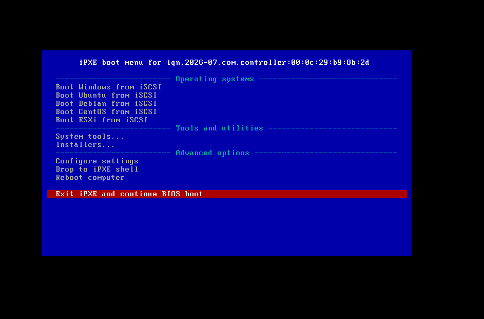
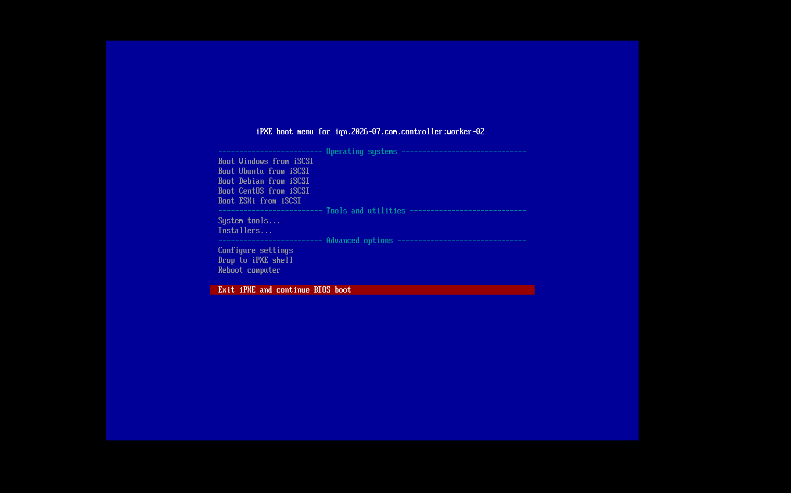
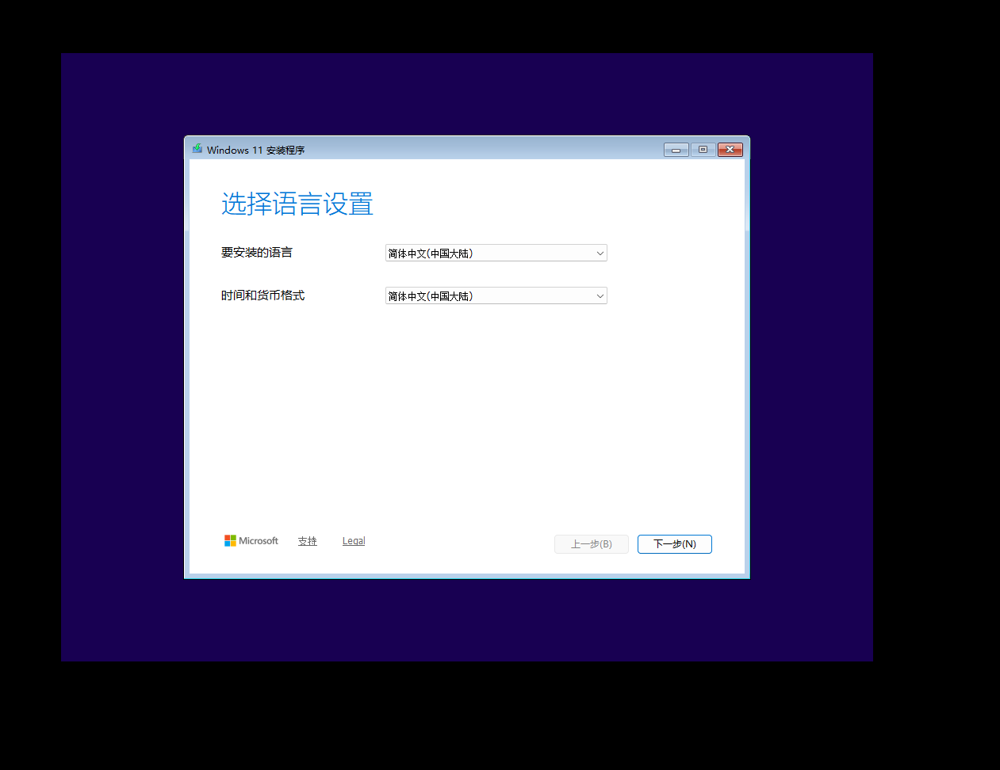

# Chapter 2: End-to-End Walkthrough — Diskless Windows 11 24H2

This chapter details how to perform a diskless installation and boot of Windows 11 24H2 under the `iPXE-All-Ready` architecture. The entire process relies on Microsoft’s native iSCSI Boot protocol stack and achieves automated deployment through a customized PE environment, the official iPXE `wimboot` kernel, and dual‑Target storage mapping.

## 2.1 Logical Boundaries of Diskless Windows Deployment

When discussing diskless Windows deployment, it is important to distinguish between two completely independent stages: system installation inside the PE environment, and system boot inside the kernel environment. These two stages depend on different low‑level mechanisms and present different engineering challenges.

1. **System installation stage (PE environment)**
   The Windows Setup program (`setup.exe`) has relatively complete support for iSCSI disks. As long as Windows PE can see the iSCSI target disk, Setup treats it as a local physical disk. The core difficulty of this stage lies in: making the PE environment recognise the network adapter and iSCSI storage controller at the earliest possible moment during boot, and correctly maintaining the iSCSI session.
2. **System boot stage (kernel environment)**
   After installation is complete, the boot process no longer depends on the PE environment. Instead, it relies on the iBFT (iSCSI Boot Firmware Table) that iPXE writes into memory, together with the iSCSI Boot driver built into the Windows kernel. As long as the installation stage finishes successfully and the correct network driver is present inside the system, the boot stage can usually take over automatically.

## 2.2 Building a Universal Windows PE Boot Environment

The PE environment inside the official Windows 11 ISO contains only basic Microsoft generic drivers and cannot be booted directly via the standard PXE method. We need to extract the necessary boot files, inject generic drivers, and leverage the official iPXE `wimboot` project to perform an in‑memory boot.

### 1. Obtaining wimboot and Extracting Boot Files

`wimboot` is a special kernel developed by the iPXE project. Its purpose is to simulate a Windows boot environment in memory and make the WIM file appear as the boot medium.

* **Download wimboot**: Go to the official iPXE website (ipxe.org/wimboot) and download the latest `wimboot` binary.
* **Extract ISO boot files**: From an official Windows 11 ISO image, extract the following three critical files:
  * `sources/boot.wim` (Windows PE core image)
  * `boot/bcd` (Boot Configuration Data)
  * `boot/boot.sdi` (System Deployment Image)

### 2. Offline Generic Driver Injection

In virtualized environments (such as VMware’s vmxnet3/pvscsi) or on physical machines with newer hardware, the official `boot.wim` often lacks the necessary network or storage drivers and therefore cannot connect to the iSCSI Target. Compared with the bulky Microsoft ADK, which also has strict version dependencies, using the lightweight [Dism++](https://github.com/Chuyu-Team/Dism-Multi-language/releases/tag/v10.1.1002.2) tool for offline injection is a more efficient engineering choice.

* Open Dism++, mount `boot.wim` (choose index 1, i.e., the Windows PE environment), and configure a mount path.
* On the “Driver Management” screen, batch‑import a pre‑prepared generic driver pack (covering vmxnet3, pvscsi, iastorvd, megasas, Intel/Realtek NICs, etc.).
* Save the image in “overwrite save” mode and unmount it.

### 3. Deploying the HTTP Resource Directory

Place all the above files into the corresponding directory of the Controller node’s HTTP resource pool, with the following structure:

```text
www/Install/Windows/24H2/
├── wimboot             # Official iPXE in‑memory boot kernel
├── boot/
│   ├── bcd             # Boot Configuration Data
│   └── boot.sdi        # System Deployment Image
└── sources/
    └── boot.wim        # PE core image after driver injection
```

## 2.3 Dual‑Target Storage Architecture and Automated Registration

A Windows 11 installation requires two storage resources: a target disk to which the system will be written, and an ISO image containing the installation files. In this project, both are provided to the Worker node via iSCSI.

### 1. Preparing Storage Backend Files

Inside the Controller node’s data disk directory (e.g., `/pool1/iscsi_img`), prepare the following files:

```bash
cd /pool1/iscsi_img

# Create a 60 GB sparse file for the system disk (follow the naming convention in Section 1.6)
fallocate -l 60G worker-01.Windows.img

# Place the official Windows 11 24H2 ISO image in this directory and rename it
# Example filename: worker-01.Windows.iso
```

### 2. Comparison Between the Traditional Approach and the iSCSI Virtual Optical Drive Approach

For using the ISO installation files inside the PE environment, a common practice is to share them over SMB. However, this approach suffers from a clear interaction gap in practice:

**Workflow of the traditional SMB share approach:**

1. Load `boot.wim` from the network to enter the PE environment.
2. Once PE starts, it directly shows the initial Setup screen (language selection) that is bundled inside `boot.wim`.
3. At this point Setup cannot find an installation source because the SMB share has not yet been mounted.
4. The user must press `Shift + F10` to bring up a Command Prompt.
5. Manually run `net use` in the prompt to mount the SMB share.
6. Navigate to the mounted directory and manually launch `setup.exe`.

The entire process depends on human intervention, and the `net use` mount can easily fail due to network fluctuations or credential issues.

**Workflow of the iSCSI virtual optical drive approach:**

1. iPXE attaches the iSCSI system disk and the iSCSI virtual optical drive via `sanhook`.
2. Load `boot.wim` from the network to enter the PE environment.
3. During the hardware enumeration phase, PE recognises the iSCSI virtual optical drive as a local CD‑ROM device.
4. `boot.wim` automatically detects the installation files on the optical drive and launches the graphical Windows 11 Setup directly.
5. The user does not need to enter any command; they simply select the target disk in the Setup wizard.

### 3. Implementation: the `--device-type cd` Parameter

The fundamental reason for the difference in user experience between the two approaches lies in how the iSCSI Target exposes the ISO file. The automated registration script in the project repository appends the `--device-type cd` parameter when creating a LUN for a `.iso` file:

```bash
# Underlying logic the automated script uses to create a LUN for an ISO file
tgtadm --lld iscsi --op new --mode logicalunit --tid $TID --lun 1 \
       --backing-store /pool1/iscsi_img/worker-01.Windows.iso \
       --device-type cd
```

This parameter instructs `stgt` to expose this LUN as a CD‑ROM device type to the initiator. Upon receiving it, Windows PE treats it the same way as a physical optical drive and automatically loads its contents.

## 2.4 iPXE Menu Orchestration and Variable Passing

Once the storage and boot environment are ready, you need to configure the Windows installation orchestration logic in `tftp/menu.ipxe`. Here you must use the `sanhook` command together with `wimboot` for in‑memory booting.

Below is the complete script for the Windows PE installation menu entry and an explanation of the variable passing:

```ipxe
:winpe-install
echo Booting Windows PE ${arch} installer for ${initiator-iqn}
echo (for installing Windows)

# 1. Network and variable configuration
set netX/gateway ${iscsi-server}
set root-path ${base-iscsi}:${hostname}.Windows
set data-path ${base-iscsi}:${hostname}.Windows.iso
set keep-san 1

# 2. Attach iSCSI storage
echo sanhook start...
sanhook --drive 0x80 ${root-path} || goto failed
sanhook --drive 0x81 ${data-path} || goto failed

# 3. Load wimboot and boot files
echo set base url starting
set base-url http://${controller_ip}:88/Install/Windows/24H2
kernel ${base-url}/wimboot
initrd ${base-url}/boot/bcd bcd
initrd ${base-url}/boot/boot.sdi boot.sdi
initrd ${base-url}/sources/boot.wim boot.wim
boot || goto failed
goto start
```

### Core Logic and Variable Passing Analysis

1. **Variable assembly and IQN mapping**
   The variables `${base-iscsi}` and `${hostname}` used in the script are the base variables obtained via DHCP and assembled in `boot.ipxe`. Here they are further combined into a full iSCSI URI, ensuring that iPXE can precisely request the corresponding LUNs created by the automated script in Section 2.3.
2. **Gateway setting (`set netX/gateway`)**
   Inside the PE environment, Windows may not correctly obtain the default route. Forcing the gateway to the iSCSI Server’s IP ensures that network traffic in the PE environment is routed correctly, preventing the iSCSI session from dropping.
3. **Keeping SAN connections alive (`set keep-san 1`)**
   By default, iPXE tears down all iSCSI connections before loading a kernel. Setting `keep-san 1` instructs iPXE to keep the iSCSI sessions active and hand them over to the underlying BIOS/UEFI and subsequently to the operating system.
4. **wimboot’s initrd alias mapping**
   The `wimboot` kernel relies on specific file names to identify boot files. The meaning of `initrd ${base-url}/boot/bcd bcd` is to rename the downloaded file to `bcd` inside the in‑memory virtual filesystem, so that `wimboot` can correctly construct the Windows boot environment.

## 2.5 Practical Walkthrough: Installation and First Boot

This section records the complete step‑by‑step procedure from starting the Controller to Windows 11 24H2 successfully reaching the desktop.

### 1. Starting the Controller and Verifying Basic Services

First, start the Controller node virtual machine (with Debian/Ubuntu already installed and Docker engine configured). After cloning or pulling the `iPXE-All-Ready` repository, launch the Docker Compose stack:

```bash
cd /opt/ipxe-all-ready
docker compose up -d
```

After the services are up, you can verify that DHCP and TFTP are running by capturing packets or accessing port 8080 of the Controller (if the dnsmasq status panel is configured).
Next, verify that the HTTP endpoint is correctly serving boot files such as `wimboot`:

```bash
curl -I http://<controller_ip>:88/Install/Windows/24H2/wimboot
# Expected: HTTP/1.1 200 OK
```

### 2. Preparing the iSCSI Storage Backend and Automated Registration

Inside the `iscsi_img` directory on the data disk, prepare the system disk image and the ISO file. In this walkthrough we use `zh-cn_windows_11_business_editions_version_24h2_updated_sep_2025_x64_dvd_84877922.iso`.

```bash
cd /pool1/iscsi_img
fallocate -l 60G worker-02.Windows.img
# Ensure the ISO file is renamed to worker-02.Windows.iso
```

Make the automated registration script in the repository root executable and run it. The script automatically scans the directory and creates the corresponding iSCSI Targets and LUNs:

```bash
chmod +x iscsi-target-gen.sh
./iscsi-target-gen.sh
```

**Example script output:**

```text
Found the following image files:
  worker-02.Windows.img
  worker-02.Windows.iso
Using base IQN template: iqn.2026-07.com.controller:<filename/suffix>

Created Target: iqn.2026-07.com.controller:worker-02.Windows (TID=1, type: IMG)
  Created LUN 1 -> /home/iscsi_img/worker-02.Windows.img
  Bound access policy -> ALL

Created Target: iqn.2026-07.com.controller:worker-02.Windows.iso (TID=2, type: ISO)
  Created LUN 1 -> /home/iscsi_img/worker-02.Windows.iso
  Bound access policy -> ALL

Displaying current Target configuration:
Target 1: iqn.2026-07.com.controller:worker-02.Windows
    ...
        LUN: 1
            Type: disk
            Backing store type: rdwr
            Backing store path: /home/iscsi_img/worker-02.Windows.img
    ...
Target 2: iqn.2026-07.com.controller:worker-02.Windows.iso
    ...
        LUN: 1
            Type: cd/dvd
            Backing store type: mmc
            Backing store path: /home/iscsi_img/worker-02.Windows.iso
    ...
```

*Note: The `Type: cd/dvd` and `Backing store type: mmc` for Target 2 confirm that the `--device-type cd` parameter has taken effect and the ISO has been correctly mapped as a virtual optical drive.*

### 3. Creating the Worker VM and Capturing the MAC Address for the First Time

Create a Windows 11 Worker virtual machine in VMware:

* **Hardware configuration**: 2 vCPUs, 4 GB RAM.
* **Disk configuration**: Assign a 1 GB virtual disk (VMware requires a disk when creating a Win11 VM and it cannot be removed; allocate the minimum size — the installation will not write to this local disk).
* **Firmware and security**: Configure for UEFI mode, enable TPM 2.0 if desired, and **you must disable Secure Boot**.
* **Network**: Use the same NAT network as the Controller VM.

Start the VM for the first time. Since no static DHCP binding has been configured yet, the real MAC address of the machine will be displayed at the top of the iPXE menu.



Take note of this MAC address and add a hostname assignment in the `dnsmasq/dhcp-hosts.conf` file on the Controller node:

```text
# Format: MAC address, hostname, IP (optional)
00:0c:29:38:5b:2f,worker-02
```

After saving the file, send a `HUP` signal to the dnsmasq process to hot‑reload the configuration without restarting the container:

```bash
docker exec ipxe-dnsmasq killall -HUP dnsmasq
```

### 4. Variable Chain Takes Effect and WinPE Boot

Restart the diskless Windows 11 VM. At this point, the base IQN displayed at the top of the iPXE menu has been dynamically assembled as `iqn.2026-07.com.controller:worker-02`, proving that the DHCP variable passing chain is working.



From the menu choose `Installers`, then select `Hook Windows iSCSI and boot WinPE for installation` to begin the WinPE boot process.


iPXE will attach two iSCSI sessions in the background and pull `wimboot` and the boot files over HTTP.


After loading completes, the system will automatically enter the graphical Windows 11 Setup wizard. This screen is the result of `setup.exe` running automatically from the iSCSI virtual optical drive.



### 5. Workaround for a 24H2 Setup Bug (Critical Detail)

Proceed normally by clicking “Next” until you reach the “Choose installation option” screen.
**Note**: Windows 11 24H2 introduced a completely new WinUI‑based Setup. Based on community field reports (see [Netboot Windows 11 with iSCSI and iPXE](https://terinstock.com/post/2025/02/Netboot-Windows-11-with-iSCSI-and-iPXE/)), when running against an iSCSI network disk the new Setup crashes silently without error messages at the “Searching for disks” stage due to a compatibility bug.

**Solution**: On the bottom‑left corner of this screen, click **“Previous version of Setup”** to switch back to the traditional Win32 Setup, which completely avoids this bug.


Then, on the disk selection screen, select the 60 GB iSCSI system disk (unallocated space) that was attached earlier via `sanhook` and click “Next” to begin the normal file copy and installation process.


### 6. OOBE Configuration and First System Boot

After installation completes and the machine has rebooted several times, the system will enter the OOBE (Out‑of‑Box Experience) screen. Windows 11 by default forces an internet connection and a Microsoft account sign‑in. In a diskless environment, to avoid getting stuck because network routing is not fully configured, you can bypass this requirement with a command:

1. On the network connection screen, press `Shift + F10` to bring up a Command Prompt.

2. Type the following command and press Enter to invoke the local account creation wizard:

   ```cmd
   start ms-cxh:localonly
   ```

3. Create a local account in the window that pops up and finish the remaining privacy settings.

Once the desktop appears, the diskless installation phase of Windows 11 24H2 is officially over.

For subsequent daily use, simply select `Boot Windows from iSCSI` from the top line of the iPXE menu. iPXE will execute `sanboot`, writing the iSCSI connection information into the iBFT, and the Windows kernel will natively take over the system disk and boot directly to the desktop.


At this point the full diskless deployment workflow for Windows 11 24H2 is complete.

## 2.6 Boot Takeover Mechanism and the “Driver Machine‑Shop” Fallback Tactic

In Section 2.5 we completed the installation of Windows 11 24H2 and successfully reached the desktop. This section dives deeper into the underlying takeover mechanism after a system restart and provides a fallback approach for dealing with extreme hardware compatibility issues.

### 1. The Seamless iBFT Takeover Principle

When the user chooses `Boot Windows from iSCSI` from the iPXE menu, iPXE executes the `sanboot` command. Unlike `sanhook`, which is used during the installation stage, `sanboot` not only establishes the iSCSI session but also fully hands over control to the underlying hardware.

During this process, iPXE writes the current iSCSI connection parameters (including Target IP, port, IQN, LUN ID, and CHAP authentication information) into the **iBFT (iSCSI Boot Firmware Table)** in motherboard memory. The iBFT is a standard ACPI table structure.

When the Windows kernel begins loading, its built‑in Microsoft iSCSI Initiator driver reads this iBFT very early in the boot stage. Based on the parameters in the table, the system automatically re‑establishes the iSCSI session at the lowest level and takes over the system disk.

**Engineering benefits**:

* **Zero system‑level modification**: The entire process relies purely on native Windows mechanisms; there is no need to modify the system’s BCD (Boot Configuration Data).
* **No third‑party client**: There is no need to install any third‑party diskless client software inside the system (such as the clients used by commercial solutions like CCBoot); the system remains absolutely clean.

### 2. The Virtual Machine “Driver Machine‑Shop” Fallback Tactic

Although we injected a “universal driver pack” into `boot.wim` in Section 2.2, when faced with extremely obscure or brand‑new physical hardware, you may still encounter situations where the PE environment cannot recognise the network adapter, or the iSCSI session drops after the system restarts following installation because the driver for the physical NIC is missing (symptoms include a blue screen or being stuck at “Getting devices ready”).

In such cases you can exploit the decoupling between iSCSI block storage and the compute node, turning a virtual machine into a “driver injection machine‑shop” to break the deadlock.

**Practical steps:**

1. **Identity hijacking**
   On the Controller node, modify `dnsmasq/dhcp-hosts.conf` to temporarily bind the target physical machine’s MAC address to a VMware virtual machine, or simply have that virtual machine log in using the physical machine’s IQN via iPXE.

   ```text
   # Temporarily bind the physical machine’s MAC to a hostname used by the VM
   00:0c:29:aa:bb:cc,worker-02
   ```

   Run `docker exec ipxe-dnsmasq killall -HUP dnsmasq` to reload the configuration.

2. **Machine‑shop proxy boot**
   Start the VMware virtual machine, select `Boot Windows from iSCSI` from the iPXE menu, and mount the iSCSI system disk LUN that belongs to the physical machine. Because the VM uses standard virtual hardware (such as the vmxnet3 NIC) whose drivers are already present in the system, it can boot to the Windows desktop normally.

3. **In‑place driver injection**
   Inside the VM’s Windows system, download the obscure NIC or storage controller drivers required by the physical machine.

   * You can install them manually by pointing Device Manager to the `.inf` file.

   * Alternatively, use the `pnputil` command‑line tool to forcibly add the driver package:

     ```cmd
     pnputil /add-driver C:\path\to\driver.inf /install
     ```

     After installation, it is recommended to open `services.msc` and verify that the “Microsoft iSCSI Initiator Service” is set to start Automatically.

4. **Returning the LUN and booting the physical machine**
   **Critical detail**: The virtual machine must be **fully shut down** (Shutdown), not suspended or restarted. Only a full shutdown causes the VM to send a Logout PDU to the iSCSI Target and release control of the LUN. If the LUN is not released, the physical machine will be unable to attach the disk at boot because of a LUN reservation conflict.

   After the VM releases the LUN, restore the physical machine’s real MAC binding on the Controller. When the physical machine powers on again, its system disk now natively contains the correct physical drivers, the iSCSI session can be established properly, and the system boots successfully.

Through this “machine‑shop” tactic, `iPXE-All-Ready` completely eliminates the cold‑boot deadlock caused by missing hardware drivers, achieving a true state of “All Ready”.