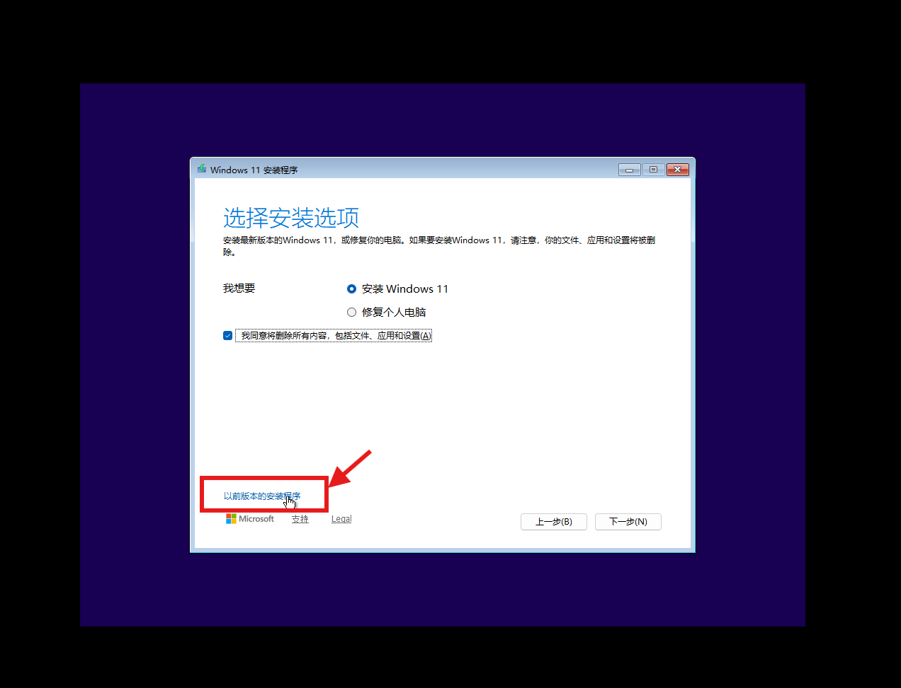

# 第二章：Windows 11 24H2 无盘系统全流程实战

本章将详细阐述如何在 `iPXE-All-Ready` 架构下，完成 Windows 11 24H2 的无盘安装与启动。整个流程依赖微软原生的 iSCSI Boot 协议栈，通过定制 PE 环境、iPXE 官方 `wimboot` 内核以及双 Target 存储映射，实现系统的自动化部署。

## 2.1 Windows 无盘部署的逻辑边界

在讨论 Windows 无盘部署时，需要明确区分两个完全独立的阶段：PE 环境下的系统安装，以及内核环境下的系统启动。这两个阶段依赖的底层机制不同，需要解决的工程问题也不同。

1. **系统安装阶段（PE 环境）**
   Windows 安装程序（`setup.exe`）对 iSCSI 磁盘的支持较为完善。只要 Windows PE 能够识别出 iSCSI 目标磁盘，安装程序就会将其视为本地物理硬盘。该阶段的核心难点在于：如何让 PE 环境在启动的最早期识别出网卡和 iSCSI 存储控制器，并正确维持 iSCSI 会话。
2. **系统启动阶段（内核环境）**
   安装完成后的系统启动不再依赖 PE 环境，而是依赖 iPXE 写入内存的 iBFT（iSCSI Boot Firmware Table）以及 Windows 内核自带的 iSCSI Boot 驱动。只要安装阶段顺利完成，且系统内包含正确的网卡驱动，启动阶段通常可以自动接管。

## 2.2 构建通用 Windows PE 引导环境

官方 Windows 11 ISO 中的 PE 环境仅包含基础的微软通用驱动，且无法直接通过标准的 PXE 方式引导。我们需要提取必要的引导文件，注入通用驱动，并借助 iPXE 官方的 `wimboot` 项目来完成内存引导。

### 1. 获取 wimboot 与提取引导文件

`wimboot` 是 iPXE 官方开发的一个特殊内核，它的作用是在内存中模拟一个 Windows 启动环境，并将 WIM 文件虚拟为启动介质。

*   **下载 wimboot**：前往 iPXE 官方网站（ipxe.org/wimboot）下载最新版本的 `wimboot` 二进制文件。
*   **提取 ISO 引导文件**：从 Windows 11 官方 ISO 镜像中，提取以下三个关键文件：
    *   `sources/boot.wim`（Windows PE 核心镜像）
    *   `boot/bcd`（启动配置数据）
    *   `boot/boot.sdi`（系统部署映像）

### 2. 离线注入通用驱动

官方 `boot.wim` 在虚拟化环境（如 VMware 的 vmxnet3/pvscsi）或搭载较新硬件的物理机上，通常会因缺少网卡或存储驱动而无法连接 iSCSI Target。相比于体积庞大且存在严格版本依赖的微软官方 ADK，使用轻量级的 [Dism++](https://github.com/Chuyu-Team/Dism-Multi-language/releases/tag/v10.1.1002.2) 工具进行离线注入是更高效的工程选择。

*   打开 Dism++，挂载 `boot.wim`（选择索引 1，即 Windows PE 环境），配置好挂载路径。
*   在“驱动管理”界面，批量导入预先准备好的通用驱动库（包含 vmxnet3、pvscsi、iastorvd、megasas、Intel/Realtek 网卡等）。
*   以“覆盖保存”的方式保存镜像并卸载。

### 3. 部署 HTTP 资源目录

将上述所有文件放置于 Controller 节点 HTTP 资源池的对应目录下，结构如下：

```text
www/Install/Windows/24H2/
├── wimboot             # iPXE 官方内存引导内核
├── boot/
│   ├── bcd             # 启动配置数据
│   └── boot.sdi        # 系统部署映像
└── sources/
    └── boot.wim        # 注入驱动后的 PE 核心镜像
```

## 2.3 双 Target 存储架构与自动化注册

Windows 11 的安装需要两个存储资源：一块用于写入系统的目标磁盘，以及一份包含安装文件的 ISO 镜像。在本项目中，这两者均通过 iSCSI 提供给 Worker 节点。

### 1. 准备存储后端文件

在 Controller 节点的数据盘目录（如 `/pool1/iscsi_img`）中，准备以下文件：

```bash
cd /pool1/iscsi_img

# 创建 60GB 的系统盘稀疏文件（遵循 1.6 节的命名规范）
fallocate -l 60G worker-01.Windows.img

# 将 Windows 11 24H2 官方 ISO 镜像放入该目录并重命名
# 文件名示例：worker-01.Windows.iso
```

### 2. 传统方案与 iSCSI 虚拟光驱方案的对比

在 PE 环境下使用 ISO 安装文件，常见的做法是通过 SMB 网络共享。但这种方案在实际操作中存在明显的交互断层：

**传统 SMB 共享方案的操作流程：**

1. 从网络加载 `boot.wim` 进入 PE 环境。
2. PE 启动后，会直接显示 `boot.wim` 自带的初始安装界面（语言选择窗口）。
3. 此时安装程序无法找到安装源，因为 SMB 共享尚未挂载。
4. 用户需要按 `Shift + F10` 呼出命令行窗口。
5. 在命令行中手动执行 `net use` 命令挂载 SMB 共享路径。
6. 切换到挂载目录，手动运行 `setup.exe`。

整个流程依赖人工干预，且 `net use` 挂载容易因网络波动或凭据问题失败。

**iSCSI 虚拟光驱方案的操作流程：**

1. iPXE 通过 `sanhook` 挂载 iSCSI 系统盘和 iSCSI 虚拟光驱。
2. 从网络加载 `boot.wim` 进入 PE 环境。
3. PE 在硬件枚举阶段将 iSCSI 虚拟光驱识别为本地 CD-ROM 设备。
4. `boot.wim` 自动检测到光驱中的安装文件，直接启动 Windows 11 的图形化安装程序。
5. 用户无需任何命令行操作，直接在安装界面中选择目标磁盘即可。

### 3. 实现方式：`--device-type cd` 参数

两种方案体验差异的根本原因，在于 iSCSI Target 端对 ISO 文件的暴露方式。项目仓库中的自动化注册脚本在扫描到 `.iso` 文件时，会在创建 LUN 时附加 `--device-type cd` 参数：

```bash
# 自动化脚本为 ISO 文件创建 LUN 的底层逻辑
tgtadm --lld iscsi --op new --mode logicalunit --tid $TID --lun 1 \
       --backing-store /pool1/iscsi_img/worker-01.Windows.iso \
       --device-type cd
```

该参数指示 `stgt` 将此 LUN 以 CD-ROM 设备类型暴露给 Initiator。Windows PE 接收到该设备后，会按照处理物理光驱的逻辑自动加载其中的内容。

## 2.4 iPXE 菜单调度与变量传递

存储与引导环境准备就绪后，需要在 `tftp/menu.ipxe` 中配置 Windows 的安装调度逻辑。此处必须使用 `sanhook` 指令，并配合 `wimboot` 进行内存引导。

以下是 `menu.ipxe` 中 Windows PE 安装项的完整脚本及变量传递解析：

```ipxe
:winpe-install
echo Booting Windows PE ${arch} installer for ${initiator-iqn}
echo (for installing Windows)

# 1. 网络与变量配置
set netX/gateway ${iscsi-server}
set root-path ${base-iscsi}:${hostname}.Windows
set data-path ${base-iscsi}:${hostname}.Windows.iso
set keep-san 1

# 2. 挂载 iSCSI 存储
echo sanhook start...
sanhook --drive 0x80 ${root-path} || goto failed
sanhook --drive 0x81 ${data-path} || goto failed

# 3. 加载 wimboot 与引导文件
echo set base url starting
set base-url http://${controller_ip}:88/Install/Windows/24H2
kernel ${base-url}/wimboot
initrd ${base-url}/boot/bcd bcd
initrd ${base-url}/boot/boot.sdi boot.sdi
initrd ${base-url}/sources/boot.wim boot.wim
boot || goto failed
goto start
```

### 核心逻辑与变量传递解析

1. **变量拼接与 IQN 映射**
   脚本中的 `${base-iscsi}` 和 `${hostname}` 是在 `boot.ipxe` 中通过 DHCP 获取并拼接的基础变量。在此处，它们被进一步组装为完整的 iSCSI URI，确保 iPXE 能够精准请求到 2.3 节中自动化脚本创建的对应 LUN。
2. **网关设置 (`set netX/gateway`)**
   在 PE 环境下，Windows 可能无法正确获取默认路由。将网关强制设置为 iSCSI Server 的 IP，可以确保 PE 环境中的网络流量能够正确路由，避免 iSCSI 会话断开。
3. **维持 SAN 连接 (`set keep-san 1`)**
   默认情况下，iPXE 在加载内核前会断开所有 iSCSI 连接。设置 `keep-san 1` 会指示 iPXE 保持 iSCSI 会话活跃，将其移交给底层 BIOS/UEFI 和随后的操作系统。
4. **wimboot 的 initrd 别名映射**
   `wimboot` 内核依赖特定的文件名来识别引导文件。`initrd ${base-url}/boot/bcd bcd` 的含义是将下载的文件在内存虚拟文件系统中重命名为 `bcd`，`wimboot` 才能正确构建 Windows 启动环境。

## 2.5 安装过程与首次启动实战操作

本节将记录从启动 Controller 到 Windows 11 24H2 成功进入桌面的完整实战步骤。

### 1. 启动 Controller 与验证基础服务

首先启动 Controller 节点虚拟机（已安装 Debian/Ubuntu 并配置好 Docker 引擎）。克隆或拉取 `iPXE-All-Ready` 项目仓库后，启动 Docker Compose 编排：

```bash
cd /opt/ipxe-all-ready
docker compose up -d
```

服务启动后，可以通过抓包或访问 Controller 的 8080 端口（若配置了 dnsmasq 状态面板）来验证 DHCP 和 TFTP 服务的运行状态。
随后，验证 HTTP 端点是否正常分发 `wimboot` 等引导文件：

```bash
curl -I http://<controller_ip>:88/Install/Windows/24H2/wimboot
# 预期返回 HTTP/1.1 200 OK
```

### 2. 准备 iSCSI 存储后端与自动化注册

在数据盘的 `iscsi_img` 目录中准备好系统盘镜像与 ISO 文件。本实战中使用 `zh-cn_windows_11_business_editions_version_24h2_updated_sep_2025_x64_dvd_84877922.iso`。

```bash
cd /pool1/iscsi_img
fallocate -l 60G worker-02.Windows.img
# 确保 ISO 文件已重命名为 worker-02.Windows.iso
```

为仓库根目录下的自动化注册脚本授予可执行权限并运行。该脚本会自动扫描目录并创建对应的 iSCSI Target 和 LUN：

```bash
chmod +x iscsi-target-gen.sh
./iscsi-target-gen.sh
```

**脚本执行输出示例：**

```text
发现以下镜像文件：
  worker-02.Windows.img
  worker-02.Windows.iso
使用基础IQN模板: iqn.2026-07.com.controller:<文件名/后缀>

创建 Target: iqn.2026-07.com.controller:worker-02.Windows (TID=1, 类型: IMG)
  创建 LUN 1 -> /home/iscsi_img/worker-02.Windows.img
  绑定访问策略 -> ALL

创建 Target: iqn.2026-07.com.controller:worker-02.Windows.iso (TID=2, 类型: ISO)
  创建 LUN 1 -> /home/iscsi_img/worker-02.Windows.iso
  绑定访问策略 -> ALL

显示当前所有 Target 配置:
Target 1: iqn.2026-07.com.controller:worker-02.Windows
    ...
        LUN: 1
            Type: disk
            Backing store type: rdwr
            Backing store path: /home/iscsi_img/worker-02.Windows.img
    ...
Target 2: iqn.2026-07.com.controller:worker-02.Windows.iso
    ...
        LUN: 1
            Type: cd/dvd
            Backing store type: mmc
            Backing store path: /home/iscsi_img/worker-02.Windows.iso
    ...
```

*注：输出中 Target 2 的 `Type: cd/dvd` 和 `Backing store type: mmc` 证实了 `--device-type cd` 参数已生效，ISO 已被正确映射为虚拟光驱。*

### 3. 创建 Worker 虚拟机与首次 MAC 捕获

在 VMware 中创建 Windows 11 Worker 虚拟机：

*   **硬件配置**：2 核 CPU，4GB 内存。
*   **硬盘配置**：分配 1GB 虚拟硬盘（VMware 创建 Win11 模板时强制要求硬盘且无法移除，分配最小体积即可，后续安装不会写入该本地盘）。
*   **固件与安全**：配置为 UEFI 模式，建议启用 TPM 2.0，**必须关闭 Secure Boot（安全启动）**。
*   **网络**：与 Controller 虚拟机处于同一 NAT 网络。

首次启动该虚拟机，由于尚未配置 DHCP 静态绑定，iPXE 菜单上方会显示该机器的真实 MAC 地址。


记录该 MAC 地址，在 Controller 节点的 `dnsmasq/dhcp-hosts.conf` 文件中添加主机名分配：

```text
# 格式：MAC地址,hostname,IP(可选)
00:0c:29:38:5b:2f,worker-02
```

保存文件后，向 dnsmasq 进程发送 `HUP` 信号以热重载配置，无需重启容器：

```bash
docker exec ipxe-dnsmasq killall -HUP dnsmasq
```

### 4. 变量链生效与 WinPE 引导

重新启动 Windows 11 无盘虚拟机。此时，iPXE 菜单上方的基础 IQN 已动态拼接为 `iqn.2026-07.com.controller:worker-02`，证明 DHCP 变量传递链已生效。


在菜单中选择 `Installers`，随后选择 `Hook Windows iSCSI and boot WinPE for installation`，进入 WinPE 引导流程。


iPXE 将在后台挂载两个 iSCSI 会话，并通过 HTTP 拉取 `wimboot` 及引导文件。


等待加载完成后，系统将自动进入 Windows 11 的图形化安装界面。该界面即为 iSCSI 虚拟光驱中的 `setup.exe` 自动运行的结果。


### 5. 规避 24H2 安装程序 Bug（关键细节）

按照常规流程点击“下一步”，直到出现“选择安装选项”界面。
**注意**：Windows 11 24H2 引入了基于 WinUI 的全新安装程序。根据社区实战反馈（参考 [Netboot Windows 11 with iSCSI and iPXE](https://terinstock.com/post/2025/02/Netboot-Windows-11-with-iSCSI-and-iPXE/)），新版安装程序在 iSCSI 网络磁盘环境下，执行到“搜索磁盘”阶段时会因兼容性 Bug 直接闪退且无报错。

**解决方案**：在此界面左下角，点击 **“以前版本的安装程序”**（Previous Version of Setup），切换回传统的 Win32 安装程序，即可完美规避此 Bug。



随后，在磁盘选择界面选中之前通过 `sanhook` 挂载的 60GB iSCSI 系统盘（未分配空间），点击“下一步”开始正常的系统文件复制与安装流程。


### 6. OOBE 配置与系统首次启动

安装完成并经历数次重启后，系统将进入 OOBE（开箱体验）界面。Windows 11 默认强制要求连接互联网并登录微软账户。在无盘环境下，为避免网络路由配置未完成导致卡死，可通过命令绕过此限制：

1. 在要求连接网络的界面，按下 `Shift + F10` 呼出 CMD 命令行窗口。

2. 输入以下命令并回车，调用本地账户创建向导：

   ```cmd
   start ms-cxh:localonly
   ```

3. 在弹出的窗口中创建本地账户，完成剩余的隐私设置流程。

进入桌面后，Windows 11 24H2 的无盘安装阶段正式结束。

后续日常使用时，只需在 iPXE 菜单的第一行选择 `Boot Windows from iSCSI`。iPXE 会执行 `sanboot`，将 iSCSI 连接信息写入 iBFT，Windows 内核将原生接管系统盘并直接进入桌面。


至此，Windows 11 24H2 无盘部署全流程完成。

## 2.6 启动接管机制与“驱动机床”兜底战术

在 2.5 节中，我们完成了 Windows 11 24H2 的安装并成功进入桌面。本节将深入解析系统重启后的底层接管机制，并提供一套应对极端硬件兼容性问题的兜底方案。

### 1. iBFT 的无缝接管原理

当用户在 iPXE 菜单中选择 `Boot Windows from iSCSI` 时，iPXE 会执行 `sanboot` 指令。与安装阶段使用的 `sanhook` 不同，`sanboot` 不仅会建立 iSCSI 会话，还会将控制权完全移交给底层硬件。

在此过程中，iPXE 会将当前的 iSCSI 连接参数（包括 Target IP、端口、IQN、LUN ID 以及 CHAP 认证信息）写入主板内存的 **iBFT（iSCSI Boot Firmware Table）** 中。iBFT 是一种标准的 ACPI 表格结构。

当 Windows 内核开始加载时，其内置的 Microsoft iSCSI Initiator 驱动会在启动的极早期（Boot Stage）读取这张 iBFT 表。系统会根据表中的参数，自动在底层重新建立 iSCSI 会话并接管系统盘。

**工程收益**：

*   **零系统层魔改**：整个过程完全依赖 Windows 原生机制，无需修改系统的 BCD（Boot Configuration Data）引导配置。
*   **无第三方客户端**：不需要在系统内安装任何第三方的无盘客户端软件（如 CCBoot 等商业方案的客户端），系统保持绝对的纯净。

### 2. 虚拟机“驱动机床”兜底战术

尽管我们在 2.2 节中向 `boot.wim` 注入了“万能驱动全家桶”，但在面对极其冷门或最新发布的物理硬件时，仍可能遇到 PE 环境无法识别网卡，或者系统安装后重启时因缺少物理网卡驱动而导致 iSCSI 会话断开（表现为蓝屏或卡在“正在准备设备”）。

此时，可以利用 iSCSI 块存储与计算节点解耦的特性，将虚拟机作为“驱动注入机床”来破除死锁。

**实战操作步骤：**

1. **身份劫持**
   在 Controller 节点上，修改 `dnsmasq/dhcp-hosts.conf`，将目标物理机的 MAC 地址临时绑定给一台 VMware 虚拟机，或者直接让该虚拟机在 iPXE 中使用物理机的 IQN 发起登录。

   ```text
   # 临时将物理机 MAC 绑定给虚拟机使用的 hostname
   00:0c:29:aa:bb:cc,worker-02
   ```

   执行 `docker exec ipxe-dnsmasq killall -HUP dnsmasq` 重载配置。

2. **机床代工**
   启动该 VMware 虚拟机，通过 iPXE 菜单选择 `Boot Windows from iSCSI`，挂载该物理机专属的 iSCSI 系统盘 LUN。由于虚拟机使用的是标准虚拟硬件（如 vmxnet3 网卡），其驱动已包含在系统中，因此可以正常进入 Windows 桌面。

3. **原位驱动注入**
   在虚拟机的 Windows 系统内，下载物理机所需的冷门网卡或存储控制器驱动。

   * 可以通过设备管理器手动指定 `.inf` 文件进行安装。

   * 或者使用 `pnputil` 命令行工具强制添加驱动包：

     ```cmd
     pnputil /add-driver C:\path\to\driver.inf /install
     ```

     安装完成后，建议打开“服务”（`services.msc`），确认“Microsoft iSCSI Initiator Service”处于“自动”启动状态。

4. **归还 LUN 与物理机启动**
   **关键细节**：必须将虚拟机**彻底关机**（Shutdown），而不是挂起或重启。只有彻底关机，虚拟机才会向 iSCSI Target 发送 Logout 报文，释放 LUN 的控制权。如果未释放，物理机启动时会因 LUN 占用冲突而无法挂载磁盘。

   虚拟机释放 LUN 后，在 Controller 端恢复物理机的真实 MAC 绑定。物理机再次通电时，其系统盘内已原生包含了正确的物理驱动，iSCSI 会话可正常建立，系统即可顺利启动。

通过这套“机床”战术，`iPXE-All-Ready` 彻底消除了硬件驱动缺失带来的冷启动死锁，实现了真正意义上的“一切就绪（All Ready）”。